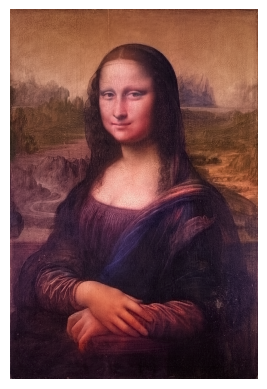
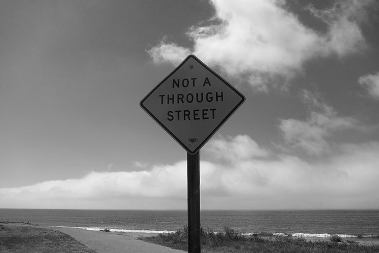
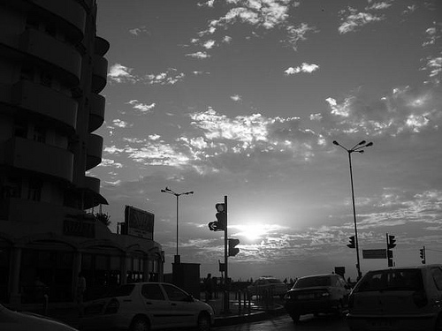
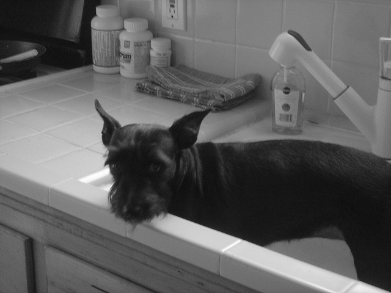
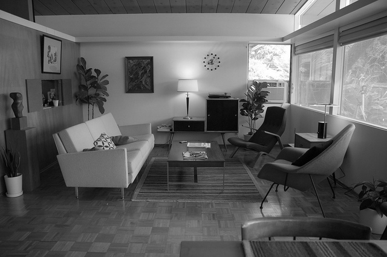
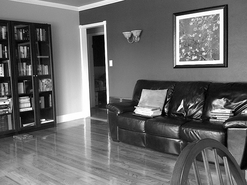
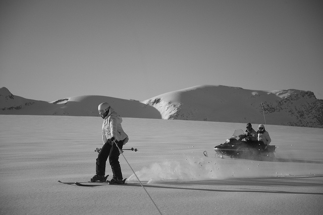
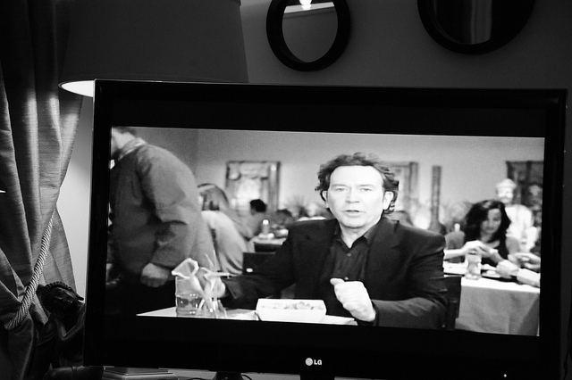

# Colorize Diffusers

Diffusion Pix2Pix colorizer model built using Hugging Face's Diffusers framework

## How does it work?

Based on a grayscale image we try to predict its colors.


Usually diffusion models are composed of multiple components and models. This one requires two of them:
- **UNet**:
  - Predicts the noise $n$ at each timestep $t$


- **Noise Scheduler**:
    - During training it adds $n$ amount of noise at each timestep $t$, gradually transforming the image into pure noise
    - During inference it guides the denoising process, which aims to recover the clean image from the noisy input.


In this case in order to condition model we will not try to generate an image based on pure noise but rather from the concatenation of pure noise (the channels we are looking to predict <color>) and the grayscale image.

The main goal is to denoise the input data in order to produce the colors from the noisy channels.

For this model we work in the $LAB$ / $CIELAB$ colorspace. Where one channel corresponds to lightness (range: $[0, 100]$ ) and the ab channels to the "color" of the image with an approximate range of $[-128, 127]$.

Its not necessary to use the $LAB$ colorspace in this task but it does simplify the model a lot. With RGB we would have an input size between 4-6 (3 noisy channels to predict RGB, and either 1 or 3 channels for the concatenated base grayscale image), but with $LAB$ we only need to predict two channels (a & b) and the lightness channel works the same as a grayscale image, we just need to rescale it.

## Inference

The model has been trained both with the `CelebA-HQ` dataset and `C0C0 2017` and their respective weights can be downloaded and loaded into the model to be used by following the snippet below.

|Dataset|Input Size|Weights Repo ID|
|:---|---:|:---|
|CelebA-HQ|64x64|[tassarar/colorize-celeba-v1](https://huggingface.co/tassarar/colorize-celeba-v1)|
|COCO 2017|128x128|[tassarar/colorize-coco-v1](https://huggingface.co/tassarar/colorize-coco-v1)|

**Example**
```python
import matplotlib.pyplot as plt
from torchvision.utils import save_image

from colorizer.pipeline import Pix2PixColorizerPipeline
from colorizer.utils import single_image_predict


pipe = (
  Pix2PixColorizerPipeline
    .from_pretrained("tassarar/colorize-coco-v1")
    .to("cuda")
)

img_path = "examples/gioconda/gioconda-original.jpg"
colorized = single_image_predict(path=img_path, pipeline=pipe)

# save_image(colorized, "gioconda-colorized.png")

plt.imshow(img_path.permute(1, 2, 0))
plt.axis("off")
plt.show()
```



## Training

This repo does not provide a single training script directly but does provide `Trainer` class tailored for colorization which can be customized with different model arquitectures and schedulers.

The `Trainer` class includes:
- Checkpointing
- Resuming training
- Progress tracking
- TensorBoard for experiment tracking
- Evaluation (Usable through TensorBoard)
- Saving trained pipelines

**Example**
```python
import glob

from diffusers import UNet2DModel, DDPMScheduler
from diffusers.training_utils import EMAModel
from torch.optim import AdamW
from torch.utils.data import DataLoader

from colorizer.dataset import ImageDataset
from colorizer.trainer import Trainer
from colorizer.utils import load_validation_images

train_ds = ImageDataset(glob.glob("train/*.jpg"), resize=128)
train_dataloader = DataLoader(
  train_ds,
  batch_size=8,
  num_workers=4,
  pin_memory=True,
  shuffle=True
)
val_set =  load_validation_images(
  glob.glob("val/*.jpg"),
  resize=128,
  load_as_rgb=False,
  random_sample=True,
  seed=0,
  max_images=16
)

unet = UNet2DModel(
  sample_size=128,
  in_channels=3,
  out_channels=2
)
ema = EMAModel(unet.parameters())
scheduler = DDPMScheduler(num_train_timesteps=2000)
optimizer = AdamW(unet.parameters(), lr=5e-5)

trainer = Trainer(
  unet=unet,
  ema=ema,
  noise_scheduler=scheduler,
  checkpointing_steps=1000,
  checkpoints_total_limit=10,
  checkpoints_output_dir="checkpoints",
  tracker_experiment_name="colorize-exp-1",
)

trainer.train(
  validation_images=val_set,
  validation_steps=4000
)

trainer.save_pipeline("./colorization-pipeline")
```

## Examples

| Input (Grayscale) | Colorized | Original |
|---|---|---|
||  |  |
||  |  |
||  |  |
||  |  |
||  |  |
||  |  |
||  |  |
